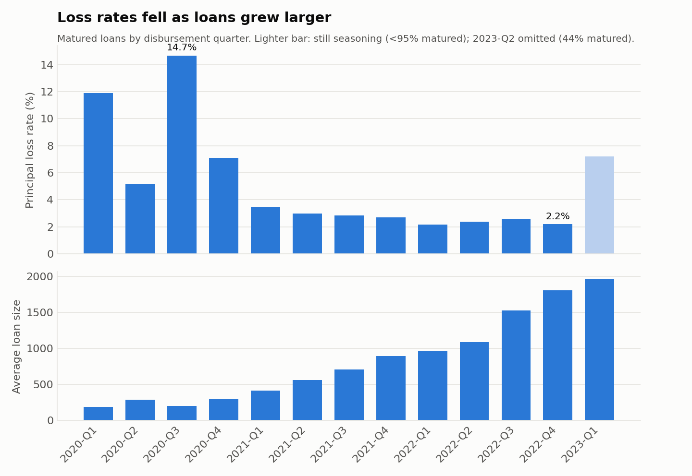
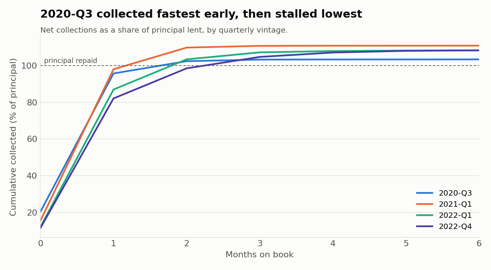
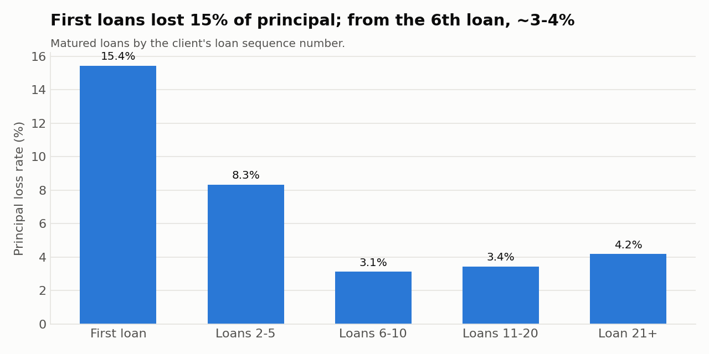

# Fintech Loan Portfolio — Vintage & Credit-Risk Analysis (SQL)

Credit-risk analysis of a fintech's short-term loan book: **71,478 loans,
GHS 46.5M lent to 10,276 clients between 2020 and 2023**, followed repayment by
repayment. The anonymised dataset was provided as a case study during a job
interview; all amounts are in Ghanaian cedis (GHS). The question a credit or finance team would ask: *is this book
getting safer as it grows, and why?*

**Author:** Kojo Safo · DataWize Analytics · [Portfolio](https://kojosafo86.github.io)
**Stack:** SQL (DuckDB) · Python (pandas, matplotlib)

---

## TL;DR

- **The matured book is profitable:** it collected **1.07 for every 1.00 lent**,
  with **4.7% of principal lost**.
- **Loss rates fell from 14.7% (2020-Q3 vintage) to ~2–3% through 2021–22**,
  while the average loan grew almost **9x** (201 → 1,811).
- **That improvement is mostly borrower selection, not better underwriting.**
  Every client in the data took their first loan in 2020. The 1,761 clients
  (17%) who didn't repay their first loan never borrowed again; the rest took
  8.2 loans each. Later vintages are made up only of proven repayers.
- **Longer-tenor loans are the risk to watch.** 4–6 instalment loans,
  introduced in late 2021, lose **16.7%** of principal against **2.8%** for
  1–3 instalment loans of the same size — about **6x**.
- **Early warning:** the 2023-Q1 vintage, 87% matured, is already at **7.2%**
  loss — the worst since 2020. It needs watching as it finishes seasoning.



---

## Getting the grain right (the first finding)

The source extract has **one row per payment transaction**, not per loan. A
loan with three instalments and a few part-payments appears many times, and
loan-level fields such as `TOTAL_LOAN_DISBURSED_AMOUNT` repeat on every row.

Summing that column straight from the raw file gives **138.7M "disbursed" —
three times the true 46.5M.** An earlier version of this project made exactly
that mistake. [`sql/00_build_model.sql`](sql/00_build_model.sql) now builds
three tables at their correct grain before any analysis:

| Table | Grain | Built from |
|---|---|---|
| `loans` | one row per loan | loan fields deduplicated, plus repayment outcome |
| `installments` | one row per loan instalment | contractual schedule and amounts due |
| `payments` | one row per transaction | net payments (reversals included) |

Every run checks that net payments reconcile to the cent at both grains
(49,273,494.52).

**Definitions**

- **Vintage** — the quarter a loan was disbursed. (The source's
  `CLIENT_COHORT` field is the client's *first-loan* month and has only three
  values, so it can't show a trend.)
- **Matured** — the final instalment fell due at least 60 days before the
  snapshot (10 July 2023, the last transaction). Loss metrics use matured
  loans only.
- **Principal loss rate** — principal not recovered by net payments, as a share
  of principal lent.
- **Settled on time** — net payments reached 99% of the amount due by the final
  due date.

---

## Findings

### 1. The book as a whole

| Metric | Value |
|---|---|
| Loans / clients | 71,478 / 10,276 |
| Principal lent | GHS 46.45M (average loan GHS 650) |
| Matured loans | 70,626 |
| Collected per 1.00 lent (matured) | **1.07** |
| Principal loss rate (matured) | **4.7%** |
| Settled on time (matured) | 79.3% |

### 2. Vintages: losses fell as loans grew

| Vintage | Loans | Avg loan (GHS) | Loss rate | On time |
|---|---:|---:|---:|---:|
| 2020-Q3 | 15,848 | 201 | 14.7% | 68.3% |
| 2020-Q4 | 13,177 | 298 | 7.1% | 75.9% |
| 2021-Q1 | 8,042 | 414 | 3.5% | 81.5% |
| 2021-Q4 | 4,665 | 892 | 2.7% | 85.4% |
| 2022-Q2 | 3,728 | 1,089 | 2.4% | 86.8% |
| 2022-Q4 | 2,767 | 1,811 | 2.2% | 86.6% |
| 2023-Q1 *(87% matured)* | 2,566 | 1,966 | 7.2% | 87.5% |

Full table: [`results/02_vintage_performance_1.csv`](results/02_vintage_performance_1.csv).



The vintage curves show *how* the early book failed: 2020-Q3 started
strongest in its first weeks, then flattened at 103% of principal. Later vintages kept
collecting (late payments and fees) and settled around 108–111%.

### 3. Why: repeat borrowers are the safe core of the book

| Loan in client's sequence | Loans | Avg loan (GHS) | Loss rate | On time |
|---|---:|---:|---:|---:|
| First loan | 10,277 | 171 | 15.4% | 66.0% |
| Loans 2–5 | 21,464 | 269 | 8.3% | 74.7% |
| Loans 6–10 | 14,831 | 469 | 3.1% | 83.7% |
| Loans 11–20 | 17,209 | 1,050 | 3.4% | 86.3% |
| Loan 21+ | 6,845 | 1,774 | 4.2% | 86.8% |

| After the first loan… | Clients | Loans per client |
|---|---:|---:|
| Didn't repay it in full | 1,761 | 1.0 |
| Repaid it | 8,516 | 8.2 |

This is a **graduated-lending** model: start clients small, raise limits as
they repay. It works, but it also means the falling loss rate reflects who is
*left* in the book. **A new intake of first-time borrowers should be expected
to lose ~15%, not ~2%.** Forecasting on the recent vintages alone would badly
understate the risk of growth through new customers.



### 4. Product risk: tenor matters more than size

| Instalments | Matured loans | Avg loan (GHS) | Loss rate |
|---|---:|---:|---:|
| 1 | 56,175 | 547 | 3.9% |
| 2 | 7,976 | 649 | 4.1% |
| 3 | 5,129 | 1,212 | 4.5% |
| 4–6 | 1,346 | ~1,940 | 12.9%–16.5% |

Holding loan size to 1,500–2,999, **1–3 instalment loans lose 2.8%; 4–6
instalment loans lose 16.7%.** The longer products launched in October 2021 and
are still under 3% of loans, so this is the moment to reprice or tighten them,
before they scale.

### 5. What's still owed

| Status at snapshot | Loans | Still due | Principal not recovered |
|---|---:|---:|---:|
| Past maturity, unsettled | 5,690 | 2.91M | 1.69M |
| Open (in repayment window) | 35 | 0.06M | 0.05M |

Almost all unpaid balances are past maturity, so they're collection or
write-off cases rather than live exposure. 36% of unrecovered principal comes
from the two 2020-H2 vintages.

---

## Recommendations

1. **Plan growth by customer type, not blended loss rates.** Budget ~15% loss
   on first loans and ~3–4% on established repeat borrowers.
2. **Review the 4–6 instalment products** — price for a ~6x higher loss rate,
   or restrict them to clients with a longer repayment record.
3. **Monitor 2023-Q1 monthly.** Confirm whether its 7.2% is temporary
   seasoning or the start of a trend in the largest loans yet.
4. **Report vintage curves alongside portfolio totals.** Totals hid a 14.7%
   → 2.2% shift inside the book.

---

## Limitations

- **Source:** an anonymised extract supplied as an interview case study. The
  raw data isn't published; the aggregated results in `results/` are. There is
  no detail on the lender's product rules or collections process.
- **No borrower data:** there are no income, credit-score or demographic fields,
  so this analyses *behaviour*, not the reasons behind it.
- **Closed borrower base:** every client joined in 2020, so later vintages
  contain no new customers — which is exactly why finding 3 matters.
- **Amounts due include fees** and, it appears, late charges. For some 4–6
  instalment loans the recorded total due is slightly *below* principal, which
  suggests fees are recorded differently on those products — worth confirming
  with the data owner before pricing decisions.
- **Loss is a proxy:** "principal not recovered as at the snapshot". Some past-
  maturity balances may still be collected.

---

## Repository structure

```
├── README.md
├── run_analysis.py        # loads the CSV, builds the model, runs all SQL, draws charts
├── make_charts.py
├── requirements.txt
├── data/
│   └── README.md          # expected columns; the dataset itself is not published
├── sql/
│   ├── 00_build_model.sql         # raw transactions → loans / installments / payments
│   ├── 01_portfolio_overview.sql
│   ├── 02_vintage_performance.sql
│   ├── 03_vintage_curves.sql      # cumulative collections by months on book
│   ├── 04_repeat_borrowers.sql
│   ├── 05_product_risk.sql        # tenor and loan size
│   ├── 06_disbursement_trend.sql  # month-over-month (LAG) and rolling 3-month
│   └── 07_outstanding_exposure.sql
├── results/               # every query's output as CSV
└── images/                # charts used in this README
```

**SQL techniques:** deduplication to the correct grain, CTEs, window functions
(running totals, `LAG`, rolling averages, share of total), `FILTER` clauses,
vintage/cohort analysis, date arithmetic, and a reconciliation check.

## How to run

The source data isn't published (it was supplied confidentially as an
interview case study). With your own copy saved as `data/smaller_data_set.csv`
— see [`data/README.md`](data/README.md) for the expected columns:

```bash
pip install -r requirements.txt
python run_analysis.py
```

The SQL is written for DuckDB and runs on PostgreSQL with small changes to the
date functions.
